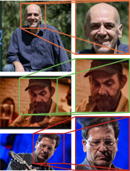

# FFHQFaceAlignment

This is an auxiliary repo for aligning and cropping faces given in arbitrary input images in order to obtain face images similar to ones provided in the FFHQ dataset. Note that only single faces will be cropped from each input image. The cropped face images may subsequently be used for StyleGAN training or for StyleGAN inversion tasks (e.g., using [HyperStyle](https://github.com/yuval-alaluf/hyperstyle)). For detecting the face in each input image we use the S³FD [1] face detector and for aligning the face we use the landmark estimation method proposed in [2]. A few examples are shown in the figure below.

<p align="center">

</p>


## Installation

We recommend installing the required packages using python's native virtual environment. For Python 3.4+, this can be done as follows:

```bash
$ python -m venv ffhqfacealignment-venv
$ source ffhqfacealignment-venv/bin/activate
(ffhqfacealignment-venv) $ pip install --upgrade pip
(ffhqfacealignment-venv) $ pip install -r requirements.txt
```


## Usage

First, you need to download the pretrained SFD [1] model using

```bash
(ffhqfacealignment-venv) $ python download.py
```

This will download and store under `lib/sfd` a pretrained model, which can also be found [here](https://drive.google.com/file/d/1IWqJUTAZCelAZrUzfU38zK_ZM25fK32S/view?usp=sharing). Then, you can use `align.py` in order to align and crop faces from a set of images under a given directory. Cropped images will be stored (using the same filename) under a given output directory (if given) in a given resolution (256x256 by default) -- for more details run `python align.py -h`:

```bash
(ffhqfacealignment-venv) $ python align.py --input-dir=<directory of original images> --output-dir=<directory of cropped images> --size=<cropped image resolution>
```

For example,

```bash
(ffhqfacealignment-venv) $ python align.py --input-dir=demo_images
```

will align and crop the faces of images in `demo_images/` and store the results (i.e., 256x256 aligned face images) under `demo_images_aligned/`.


## Credits

 - [Face Detector [1]](https://github.com/sfzhang15/SFD) 
 - [Face alignment [2]](https://github.com/1adrianb/face-alignment)


## References 

[1] Zhang, Shifeng, et al. "S3fd: Single shot scale-invariant face detector." *Proceedings of the IEEE international conference on computer vision*. 2017.

[2] Bulat, Adrian, and Georgios  Tzimiropoulos. "How far are we from solving the 2D & 3D face  alignment problem?(and a dataset of 230,000 3d facial landmarks)." *Proceedings of the IEEE International Conference on Computer Vision*. 2017.

